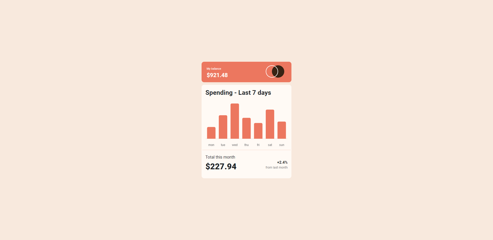

# Frontend Mentor - Expenses chart component solution

This is a solution to the [Expenses chart component challenge on Frontend Mentor](https://www.frontendmentor.io/challenges/expenses-chart-component-e7yJBUdjwt). Frontend Mentor challenges help you improve your coding skills by building realistic projects. 

## Table of contents

- [Overview](#overview)
  - [The challenge](#the-challenge)
  - [Screenshot](#screenshot)
  - [Links](#links)
- [My process](#my-process)
  - [Built with](#built-with)
  - [What I learned](#what-i-learned)
  - [Continued development](#continued-development)
  - [Useful resources](#useful-resources)
- [Author](#author)
- [Acknowledgments](#acknowledgments)

**Note: Delete this note and update the table of contents based on what sections you keep.**

## Overview

### The challenge

Users should be able to:

- View the bar chart and hover over the individual bars to see the correct amounts for each day
- See the current day’s bar highlighted in a different colour to the other bars
- View the optimal layout for the content depending on their device’s screen size
- See hover states for all interactive elements on the page
- **Bonus**: Use the JSON data file provided to dynamically size the bars on the chart

### Screenshot

### Links

- Solution URL: https://melodious-sunshine-75c24c.netlify.app/

## My process

### Built with

- Semantic HTML5 markup
- CSS custom properties
- Flexbox
- CSS Grid
- Bootstrap
- ChartJs
### What I learned

I just learned how to make a graph with ChartJs very complex at first but once i understood what was happening it was very helpful.

Also never forget this:
        var xmlhttp = new XMLHttpRequest();
        var url = "data.json";
        xmlhttp.open("GET", url, true);
        xmlhttp.send();
        xmlhttp.onreadystatechange = function(){
            if(this.readyState == 4 && this.status == 200){
                
            }

**Note: Delete this note and the content within this section and replace with your own learnings.**

### Useful resources

- https://www.chartjs.org/docs/latest/getting-started/
- https://getbootstrap.com/docs/5.3/getting-started/introduction/
- https://www.youtube.com/watch?v=UxJ5d-HGhJA
